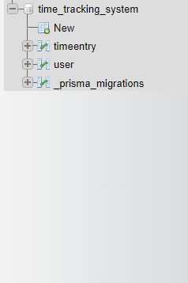
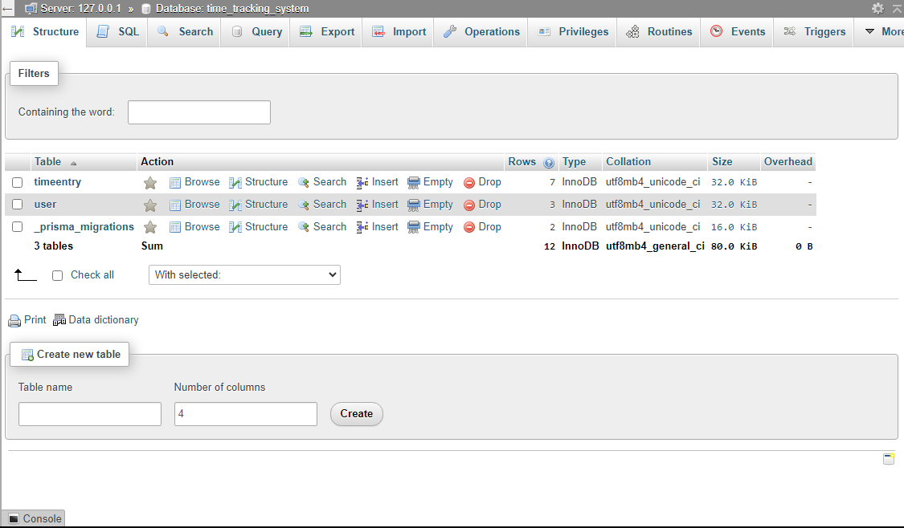
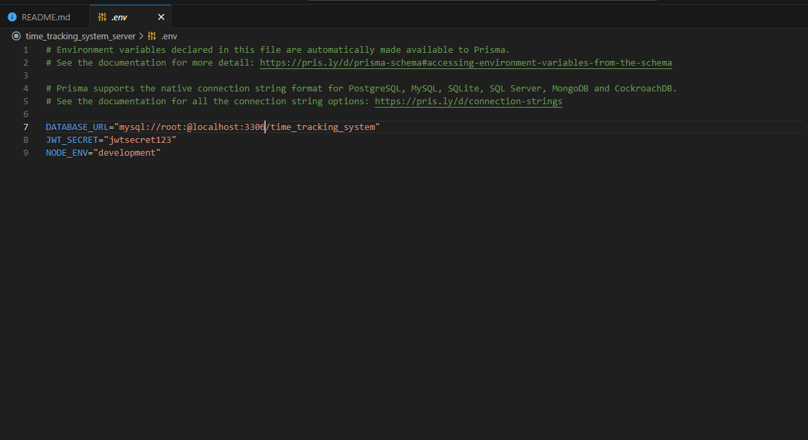

# Time Tracking System Server

## Features

- Express.js framework for building web applications
- Prisma ORM for database management
- MySQL as the database engine
- Node.js as the runtime environment
- Proper error handling for robustness
- User authentication for secure access

## Prerequisites

Before running the application, make sure you have the following installed:

- Node.js: [Download](https://nodejs.org)
- MySQL: [Download](https://www.mysql.com/downloads/)

## Installation

1. Clone the repository:

   ```bash
   git clone https://github.com/TajwarSaiyeed/time-tracking-system-server.git
   ```

2. Install the dependencies:

   ```bash
   cd time-tracking-system-server
   npm install
   ```

3. Set up the database:

   - Create a MySQL database.
     
     
   - Update the database configuration in the `.env` file.



4. Set up the database schema:

   ```bash
   npx prisma migrate dev --name init
   ```

5. Run the application:

   ```bash
   npm start || npm run dev
   ```

## Usage

- Access the application at `http://localhost:8000`.
